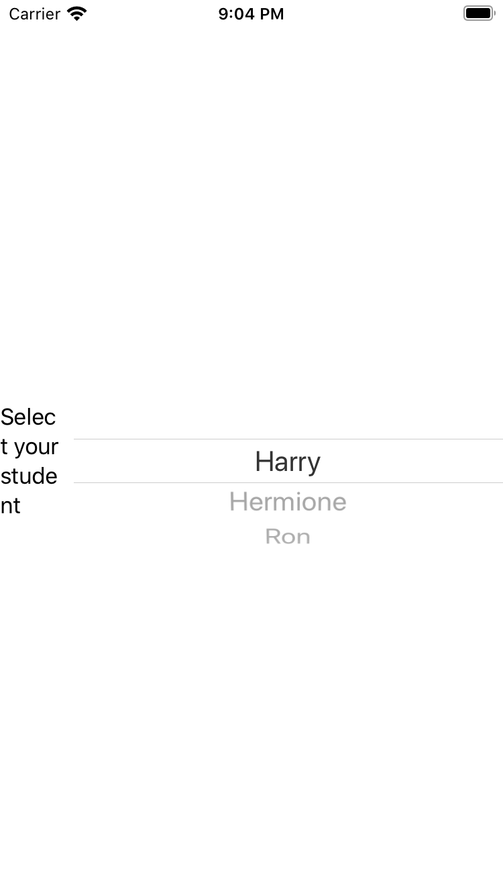

# Day 16 | [HWS 16](https://www.hackingwithswift.com/100/swiftui/16) | [Index](https://github.com/JulesMoorhouse/100DaysOfSwiftUI/blob/main/README.md)

- [P01 WeSplit](https://github.com/JulesMoorhouse/100DaysOfSwiftUI/tree/main/P01%20WeSplit/P01%20WeSplit/ContentView.swift) 

- Basics of Swift UI, this was introduction to the basic topics for the WeSplit project

