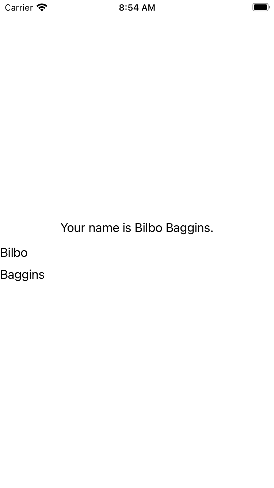

# Day 36 | [HWS 36](https://www.hackingwithswift.com/100/swiftui/36) | [Index](https://github.com/JulesMoorhouse/100DaysOfSwiftUI/blob/main/README.md)

- [P07 iExpense](https://github.com/JulesMoorhouse/100DaysOfSwiftUI/blob/main/P07%20iExpense/P07%20iExpense/ContentView.swift)

- Introduction to ObservableObject and ObservedObject.
  
