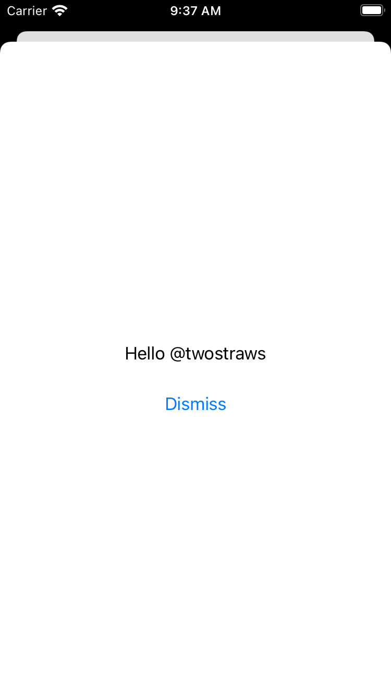

# Day 36 | [HWS 36](https://www.hackingwithswift.com/100/swiftui/36) | [Index](https://github.com/JulesMoorhouse/100DaysOfSwiftUI/blob/main/README.md)

- [P07A iExpense](https://github.com/JulesMoorhouse/100DaysOfSwiftUI/blob/main/P07%20iExpense/P07A%20iExpense/ContentView.swift)

- Showing a sheet, a second view with PresentationMode to dismiss the sheet..
  

