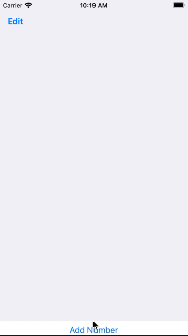

# Day 37 | [HWS 37](https://www.hackingwithswift.com/100/swiftui/37) | [Index](https://github.com/JulesMoorhouse/100DaysOfSwiftUI/blob/main/README.md)

- [P07B iExpense](https://github.com/JulesMoorhouse/100DaysOfSwiftUI/blob/main/P07B%20iExpense/P07B%20iExpense/ContentView.swift)

- Deleing list items with onDelete.
  

