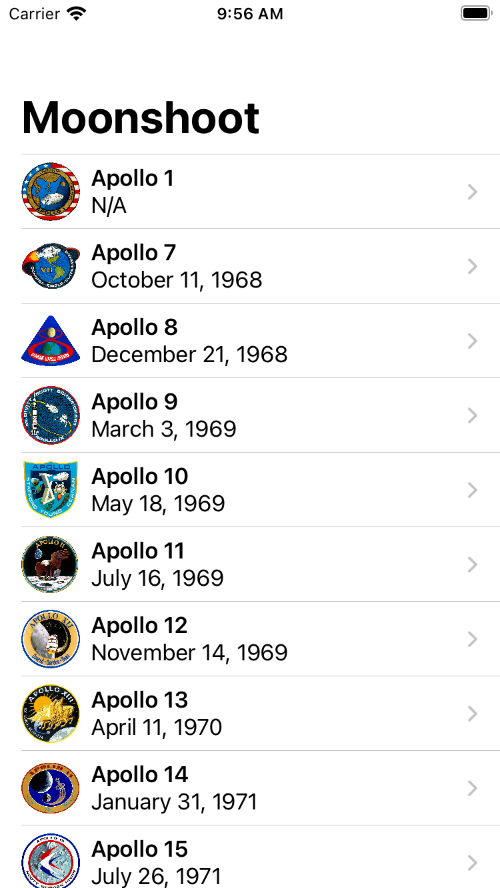

# Day 40 | [HWS 40](https://www.hackingwithswift.com/100/swiftui/39) | [Index](https://github.com/JulesMoorhouse/100DaysOfSwiftUI/blob/main/README.md)

- [P08D Moonshot](https://github.com/JulesMoorhouse/100DaysOfSwiftUI/blob/main/P08D%20Moonshoot/P08D%20Moonshoot/ContentView.swift)

- Loading codable data from a file, generics, view / date formatting.
  
