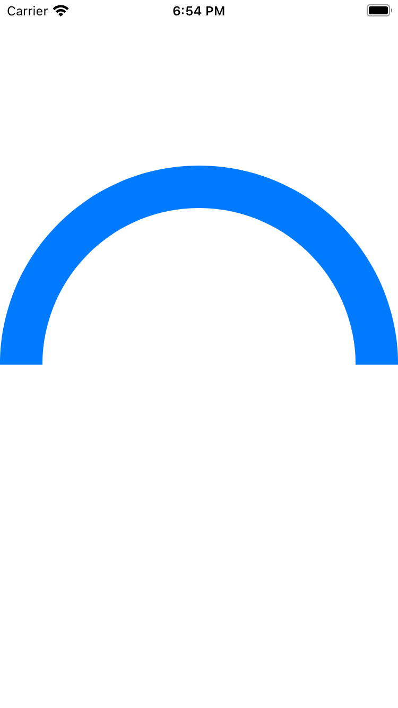

# Day 43 | [HWS 43](https://www.hackingwithswift.com/100/swiftui/43) | [Index](https://github.com/JulesMoorhouse/100DaysOfSwiftUI/blob/main/README.md)

- [P09B Drawing](https://github.com/JulesMoorhouse/100DaysOfSwiftUI/blob/main/P09B%20Drawing/P09B%20Drawing/ContentView.swift)

- Adding strokeBorder() support with InsettableShape.

