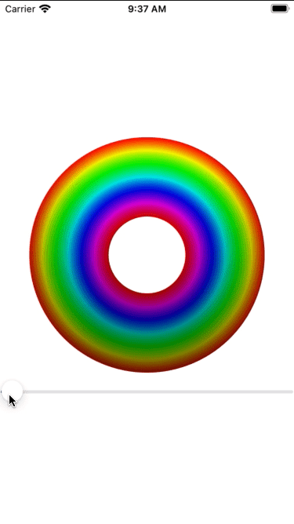

# Day 44 | [HWS 44](https://www.hackingwithswift.com/100/swiftui/44) | [Index](https://github.com/JulesMoorhouse/100DaysOfSwiftUI/blob/main/README.md)

- [P09F Drawing](https://github.com/JulesMoorhouse/100DaysOfSwiftUI/blob/main/P09F%20Drawing/P09F%20Drawing/ContentView.swift) 

- Enabling high-performance Metal rendering with drawingGroup().

