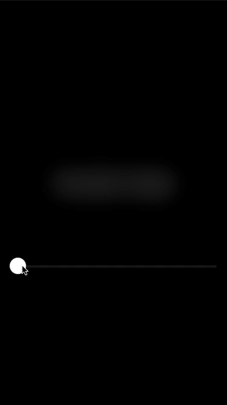

# Day 45 | [HWS 45](https://www.hackingwithswift.com/100/swiftui/45) | [Index](https://github.com/JulesMoorhouse/100DaysOfSwiftUI/blob/main/README.md)

- [P09G Drawing](https://github.com/JulesMoorhouse/100DaysOfSwiftUI/blob/main/P09G%20Drawing/P09F%20Drawing/ContentView.swift) 

- Special effects in SwiftUI: blurs, blending, and more - saturation / blur.

