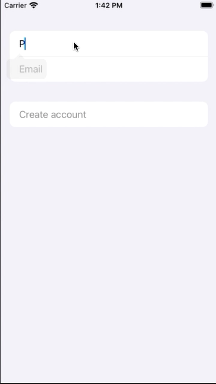

# Day 49 | [HWS 49](https://www.hackingwithswift.com/100/swiftui/49) | [Index](https://github.com/JulesMoorhouse/100DaysOfSwiftUI/blob/main/README.md)

- [P10B CupcakeCorner](https://github.com/JulesMoorhouse/100DaysOfSwiftUI/blob/main/P10B%20CupcakeCorner/P10B%20CupcakeCorner/ContentView.swift)

- Validating and disabling forms.

