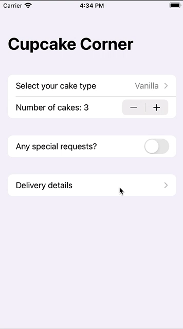

# Day 50 / 51 | [HWS 50](https://www.hackingwithswift.com/100/swiftui/50) | [Index](https://github.com/JulesMoorhouse/100DaysOfSwiftUI/blob/main/README.md)

- [P10C CupcakeCorner](https://github.com/JulesMoorhouse/100DaysOfSwiftUI/blob/main/P10C%20CupcakeCorner/P10C%20CupcakeCorner/ContentView.swift)

- Taking basic order details, checking for a valid address, preparing for checkout, encoding an ObservableObject class, sending and receiving orders over the internet.

