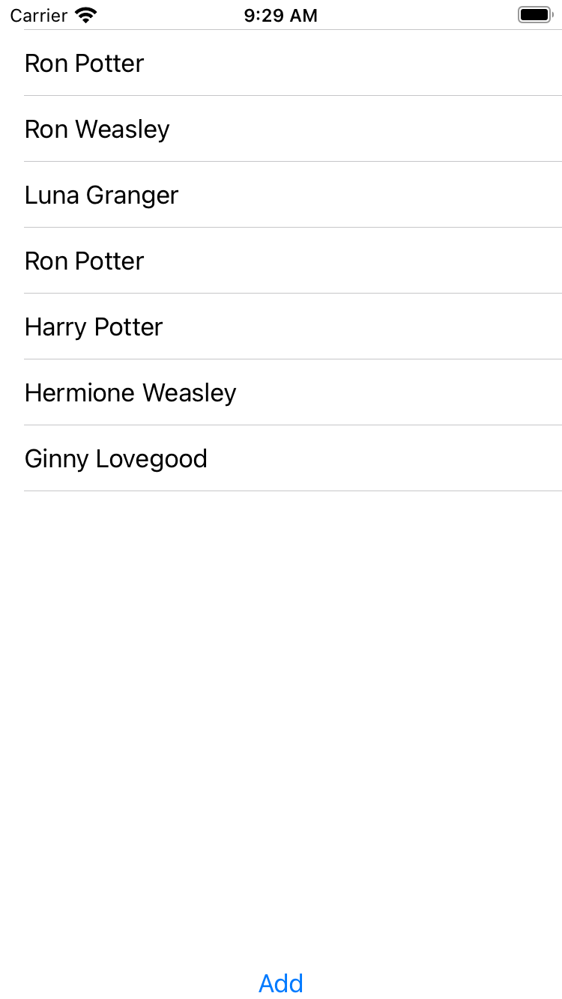

# Day 53 | [HWS 53](https://www.hackingwithswift.com/100/swiftui/53) | [Index](https://github.com/JulesMoorhouse/100DaysOfSwiftUI/blob/main/README.md)

- [P11B Bookworm](https://github.com/JulesMoorhouse/100DaysOfSwiftUI/blob/main/P11B%20Bookworm/P11B%20Bookworm/ContentView.swift)

- How to combine Core Data and SwiftUI.

