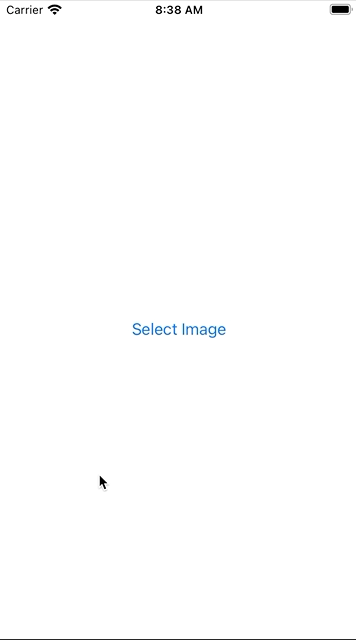

# Day 64 | [HWS 64](https://www.hackingwithswift.com/100/swiftui/64) | [Index](https://github.com/JulesMoorhouse/100DaysOfSwiftUI/blob/main/README.md)

 - [P13D InstaFilter](https://github.com/JulesMoorhouse/100DaysOfSwiftUI/blob/main/P13D%20InstaFilter/P13C%20InstaFilter/ContentView.swift)
 
 - Using coordinators to manage SwiftUI view controllers.

