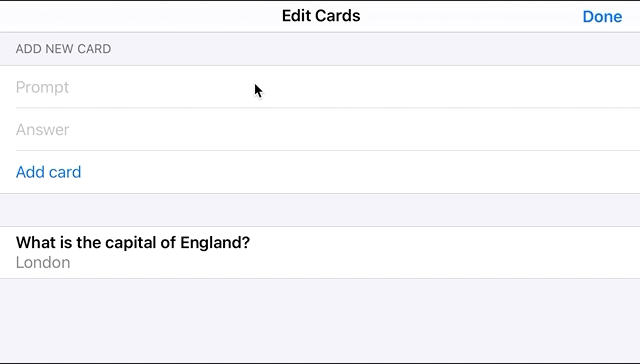

# Day 88 | [HWS 88](https://www.hackingwithswift.com/100/swiftui/88) | [Index](https://github.com/JulesMoorhouse/100DaysOfSwiftUI/blob/main/README.md)

- [ContentView.swift](https://github.com/JulesMoorhouse/100DaysOfSwiftUI/blob/main/P17M%20Flashzilla/P17M%20Flashzilla/ContentView.swift) 
  
- Designing a single card view.
- Building a stack of cards.
- Moving views with DragGesture and offset().
- Coloring views as we swipe
- Counting down with a Timer
- Ending the app with allowsHitTesting()
- Making iPhones vibrate with UINotificationFeedbackGenerator.
- Fixing the bugs.
- Adding and deleting cards.

