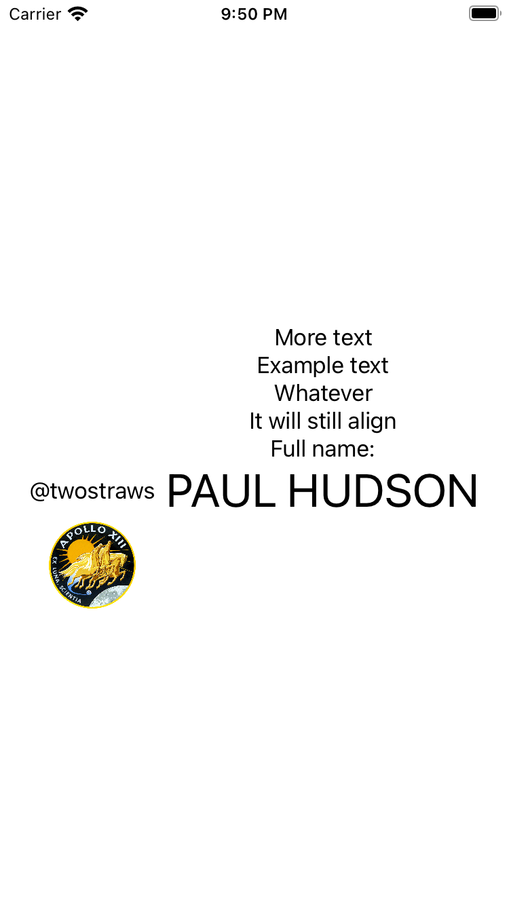

# Day 92 | [HWS 92](https://www.hackingwithswift.com/100/swiftui/92) | [Index](https://github.com/JulesMoorhouse/100DaysOfSwiftUI/blob/main/README.md)

- [ContentView.swift](https://github.com/JulesMoorhouse/100DaysOfSwiftUI/blob/main/P18E%20LayoutAndGeometry/P18E%20LayoutAndGeometry/ContentView.swift)
  
  - How to create a custom alignment guide.

