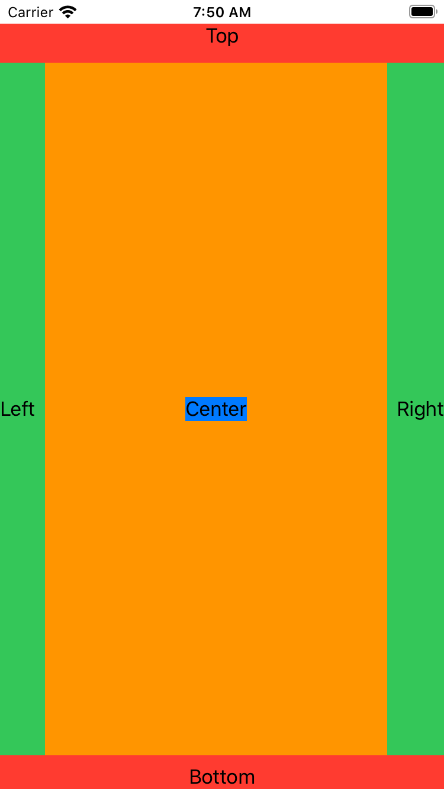

# Day 93 | [HWS 93](https://www.hackingwithswift.com/100/swiftui/93) | [Index](https://github.com/JulesMoorhouse/100DaysOfSwiftUI/blob/main/README.md)

- Understanding frames and coordinates inside GeometryReader.
  

