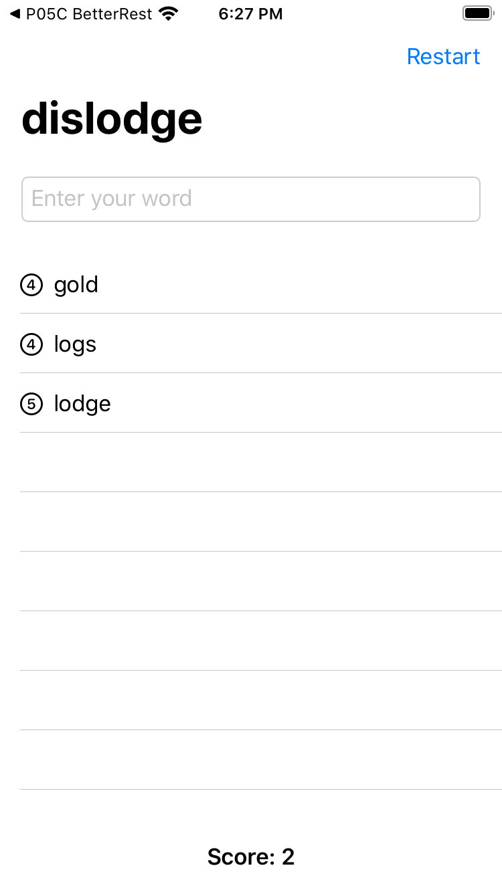

# 100DaysOfSwiftUI

**Project Prefixes**
- Pnn - Project
- PnnX - Project with challenge changes
- PnnA - Project A
- Xnn - Full challenge project

|||
|-|-|
|**Day 16** - [P01 WeSplit](https://github.com/JulesMoorhouse/100DaysOfSwiftUI/tree/main/P01%20WeSplit) / [Swift](https://github.com/JulesMoorhouse/100DaysOfSwiftUI/tree/main/P01%20WeSplit/P01%20WeSplit/ContentView.swift) - Basics of Swift UI, this was introduction to the basic topics for the WeSplit project |  |
|**Day 17** - [P01A WeSplit](https://github.com/JulesMoorhouse/100DaysOfSwiftUI/tree/main/P01a%20WeSplit) / [Swift](https://github.com/JulesMoorhouse/100DaysOfSwiftUI/tree/main/P01a%20WeSplit/P01a%20WeSplit/ContentView.swift) - The real WeSplit application, my first SwiftUI application |  |
|**Day 18** - [P01X WeSplit](https://github.com/JulesMoorhouse/100DaysOfSwiftUI/tree/main/P01X%20WeSplit) / [Swift](https://github.com/JulesMoorhouse/100DaysOfSwiftUI/tree/main/P01X%20WeSplit/P01a%20WeSplit/ContentView.swift) - Challenge - additions to the project |  |
|**Day 19** - [X01 Unit Conversion](https://github.com/JulesMoorhouse/100DaysOfSwiftUI/tree/main/X01%20Unit%20Conversion) / [Swift](https://github.com/JulesMoorhouse/100DaysOfSwiftUI/tree/main/X01%20Unit%20Conversion/X01%20Unit%20Conversion/ContentView.swift) - First full challenge project. |  |
|**Day 20** - [P02 Guess The Flag](https://github.com/JulesMoorhouse/100DaysOfSwiftUI/tree/main/P02%20Guess%20The%20Flag) / [Swift](https://github.com/JulesMoorhouse/100DaysOfSwiftUI/tree/main/P02%20Guess%20The%20Flag/P02%20Guess%20The%20Flag/ContentView.swift) - Covers VStack, HStack, ZStack, Colours, Gradients, Button actions and Alerts |  |
|**Day 21** - [P02A Guess The Flag](https://github.com/JulesMoorhouse/100DaysOfSwiftUI/tree/main/P02A%20Guess%20The%20Flag) / [Swift](https://github.com/JulesMoorhouse/100DaysOfSwiftUI/tree/main/P02A%20Guess%20The%20Flag/P02A%20Guess%20The%20Flag/ContentView.swift) - Stacking buttons, alert and style modifiers |  |
|**Day 22** - [P02B Guess The Flag](https://github.com/JulesMoorhouse/100DaysOfSwiftUI/tree/main/P02B%20Guess%20The%20Flag) / [Swift](https://github.com/JulesMoorhouse/100DaysOfSwiftUI/tree/main/P02B%20Guess%20The%20Flag/P02B%20Guess%20The%20Flag/ContentView.swift) - Review day |  |
| **Day 23** - [P03 Views And Modifiers](https://github.com/JulesMoorhouse/100DaysOfSwiftUI/tree/main/P03%20Views%20And%20Modifiers) / [Swift](https://github.com/JulesMoorhouse/100DaysOfSwiftUI/tree/main/P03%20Views%20And%20Modifiers/P03%20Views%20And%20Modifiers/ContentView.swift), [P03B Views And Modifiers](https://github.com/JulesMoorhouse/100DaysOfSwiftUI/tree/main/P03B%20Views%20And%20Modifiers) / [Swift](https://github.com/JulesMoorhouse/100DaysOfSwiftUI/tree/main/P03B%20Views%20And%20Modifiers/P03B%20Views%20And%20Modifiers/ContentView.swift), [P03C Views And Modifiers](https://github.com/JulesMoorhouse/100DaysOfSwiftUI/tree/main/P03C%20Views%20And%20Modifiers) / [Swift](https://github.com/JulesMoorhouse/100DaysOfSwiftUI/tree/main/P03C%20Views%20And%20Modifiers/P03C%20Views%20And%20Modifiers/ContentView.swift) - Views and modifiers |   |
|**Day 24** - [P03X WeSplit](https://github.com/JulesMoorhouse/100DaysOfSwiftUI/tree/main/P03X%20WeSplit%20/P01a%20WeSplit/ContentView.swift) / [Swift](https://github.com/JulesMoorhouse/100DaysOfSwiftUI/tree/main/P03X%20WeSplit%20/P01a%20WeSplit/ContentView.swift) (based on P01A WeSplit), [X02 View Modifier](https://github.com/JulesMoorhouse/100DaysOfSwiftUI/tree/main/X02%20View%20Modifier/X02%20View%20Modifier/ContentView.swift) / [Swift](https://github.com/JulesMoorhouse/100DaysOfSwiftUI/tree/main/X02%20View%20Modifier/X02%20View%20Modifier/ContentView.swift) (challenge)   [P03X Guess The Flag](https://github.com/JulesMoorhouse/100DaysOfSwiftUI/tree/main/P03X%20Guess%20The%20Flag/P02B%20Guess%20The%20Flag/ContentView.swift) / [Swift](https://github.com/JulesMoorhouse/100DaysOfSwiftUI/tree/main/P03X%20Guess%20The%20Flag/P02B%20Guess%20The%20Flag/ContentView.swift) (based on P02B Guess The Flag) - Views and Modifiers challenge. |   |
|**Day 25** - [X03 Rock Paper Scissors](https://github.com/JulesMoorhouse/100DaysOfSwiftUI/tree/main/X03%20Rock%20Paper%20Scissors) / [Swift](https://github.com/JulesMoorhouse/100DaysOfSwiftUI/tree/main/X03%20Rock%20Paper%20Scissors/X03%20Rock%20Paper%20Scissors/ContentView.swift) -  Milestone / Challenge |  |
|**Day 26** - [P04 BetterRest](https://github.com/JulesMoorhouse/100DaysOfSwiftUI/tree/main/P04%20BetterRest) / [Swift](https://github.com/JulesMoorhouse/100DaysOfSwiftUI/tree/main/P04%20BetterRest/P04%20BetterRest/ContentView.swift), [P04B BetterRest](https://github.com/JulesMoorhouse/100DaysOfSwiftUI/tree/main/P04B%20BetterRest) - Date pickers, date components and a basic ML setup. |  |
|**Day 27** - [P04C BetterRest](https://github.com/JulesMoorhouse/100DaysOfSwiftUI/blob/main/P04C%20BetterRest) / [Swift](https://github.com/JulesMoorhouse/100DaysOfSwiftUI/blob/main/P04C%20BetterRest/P04C%20BetterRest/ContentView.swift) - Stepper, DatePicker, DateFormatter. |  |
| **Day 28** - [P04X BetterRest](https://github.com/JulesMoorhouse/100DaysOfSwiftUI/blob/main/P04X%20BetterRest) / [Swift](https://github.com/JulesMoorhouse/100DaysOfSwiftUI/blob/main/P04X%20BetterRest/P04C%20BetterRest/ContentView.swift) - Challenge - DatePicker and Stepper. |  |
|**Day 29** - [P05 WordScramble](https://github.com/JulesMoorhouse/100DaysOfSwiftUI/blob/main/P05%20WordScramble) / [Swift](https://github.com/JulesMoorhouse/100DaysOfSwiftUI/blob/main/P05%20WordScramble/P05%20WordScramble/ContentView.swift), [P05B WordScramble](https://github.com/JulesMoorhouse/100DaysOfSwiftUI/blob/main/P05B%20WordScramble) / [Swift](https://github.com/JulesMoorhouse/100DaysOfSwiftUI/blob/main/P05B%20WordScramble/P05B%20WordScramble/ContentView.swift) - List, Bundle, UITextChecker and more. |  |
|**Day 30** - [P05C WordScramble](https://github.com/JulesMoorhouse/100DaysOfSwiftUI/blob/main/P05C%20WordScramble) / [Swift](https://github.com/JulesMoorhouse/100DaysOfSwiftUI/blob/main/P05C%20WordScramble/P05C%20WordScramble/ContentView.swift) - Complete app with feature / functions from day 28 / 29. |  |
|**Day 31** - [P05X WordScramble](https://github.com/JulesMoorhouse/100DaysOfSwiftUI/blob/main/P05X%20WordScramble) / [Swift](https://github.com/JulesMoorhouse/100DaysOfSwiftUI/blob/main/P05X%20WordScramble/P05C%20WordScramble/ContentView.swift) - Challenge. |  |
|**Day 32** - [P06 Animations](https://github.com/JulesMoorhouse/100DaysOfSwiftUI/blob/main/P06%20Animations) / [Swift](https://github.com/JulesMoorhouse/100DaysOfSwiftUI/blob/main/P06%20Animations/P06%20Animations/ContentView.swift) - Implicit animation example. Customizing animations.  [P06B Animations](https://github.com/JulesMoorhouse/100DaysOfSwiftUI/blob/main/P06B%20Animations) / [Swift](https://github.com/JulesMoorhouse/100DaysOfSwiftUI/blob/main/P06B%20Animations/P06B%20Animations/ContentView.swift) - Animation bindings.  [P06C Animations](https://github.com/JulesMoorhouse/100DaysOfSwiftUI/blob/main/P06C%20Animations) / [Swift](https://github.com/JulesMoorhouse/100DaysOfSwiftUI/blob/main/P06C%20Animations/P06C%20Animations/ContentView.swift) - Explicit animations. |    |
|**Day 33** - [P06D Animations](https://github.com/JulesMoorhouse/100DaysOfSwiftUI/blob/main/P06D%20Animations) / [Swift](https://github.com/JulesMoorhouse/100DaysOfSwiftUI/blob/main/P06D%20Animations/P06D%20Animations/ContentView.swift) - Controlling the animation stack.  [P06E Animations](https://github.com/JulesMoorhouse/100DaysOfSwiftUI/blob/main/P06E%20Animations) / [Swift](https://github.com/JulesMoorhouse/100DaysOfSwiftUI/blob/main/P06E%20Animations/P06E%20Animations/ContentView.swift), [P06F Animations](https://github.com/JulesMoorhouse/100DaysOfSwiftUI/blob/main/P06F%20Animations) / [Swift](https://github.com/JulesMoorhouse/100DaysOfSwiftUI/blob/main/P06F%20Animations/P06F%20Animations/ContentView.swift) - Animating gestures example.  [P06G Animations](https://github.com/JulesMoorhouse/100DaysOfSwiftUI/blob/main/P06G%20Animations) / [Swift](https://github.com/JulesMoorhouse/100DaysOfSwiftUI/blob/main/P06G%20Animations/P06G%20Animations/ContentView.swift) - Showing and hiding views with transitions example.  [P06H Animations](https://github.com/JulesMoorhouse/100DaysOfSwiftUI/blob/main/P06H%20Animations) / [Swift](https://github.com/JulesMoorhouse/100DaysOfSwiftUI/blob/main/P06H%20Animations/P06H%20Animations/ContentView.swift) - Building custom transitions using ViewModifier example |      |
|**Day 34** - [P06X Guess The Flag](https://github.com/JulesMoorhouse/100DaysOfSwiftUI/tree/main/P06X%20Guess%20The%20Flag) / [Swift](https://github.com/JulesMoorhouse/100DaysOfSwiftUI/blob/0a6ece6bce5c2ff58710ce4dcea5007bb4125daf/P06X%20Guess%20The%20Flag/P02B%20Guess%20The%20Flag/ContentView.swift) - Challenge - additions to the project. |   |
|**Day 35** - [X04 Times Tables](https://github.com/JulesMoorhouse/100DaysOfSwiftUI/tree/main/X04%20Times%20Tables) / [Swift](https://github.com/JulesMoorhouse/100DaysOfSwiftUI/blob/main/X04%20Times%20Tables/X04%20Times%20Tables/ContentView.swift) - Milestone challenge project. |   |
|**Day 36** - [P07 iExpense](https://github.com/JulesMoorhouse/100DaysOfSwiftUI/tree/main/P07%20iExpense) / [Swift](https://github.com/JulesMoorhouse/100DaysOfSwiftUI/blob/main/P07%20iExpense/P07%20iExpense/ContentView.swift) - Introduction to ObservableObject and ObservedObject.   [P07A iExpense](https://github.com/JulesMoorhouse/100DaysOfSwiftUI/tree/main/P07A%20iExpense) / [Swift](https://github.com/JulesMoorhouse/100DaysOfSwiftUI/blob/main/P07A%20iExpense/P07A%20iExpense/ContentView.swift) - Showing a sheet, a second view with PresentationMode to dismiss the sheet.   [P07B iExpense](https://github.com/JulesMoorhouse/100DaysOfSwiftUI/tree/main/P07B%20iExpense) / [Swift](https://github.com/JulesMoorhouse/100DaysOfSwiftUI/blob/main/P07B%20iExpense/P07B%20iExpense/ContentView.swift) - Deleing list items with onDelete. |    |