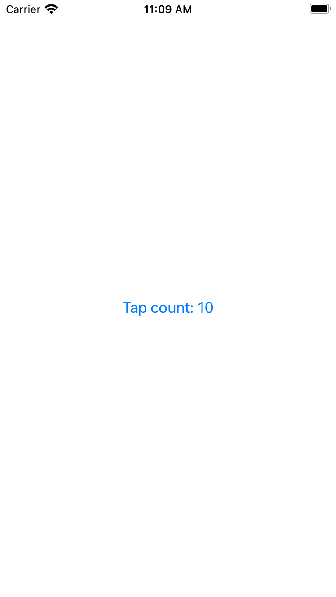
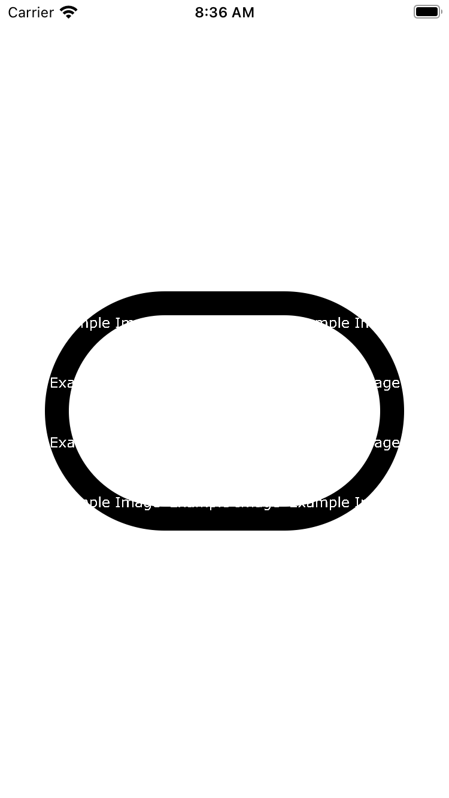
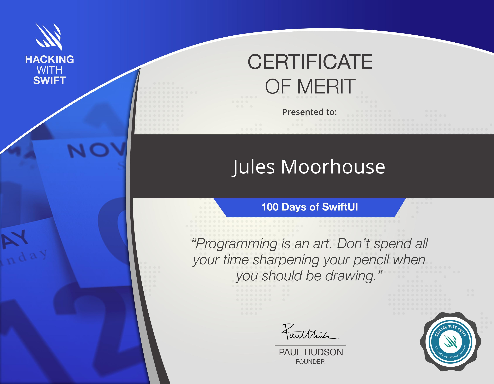

# 100DaysOfSwiftUI

**Project Prefixes**
- Pnn - Project
- PnnX - Project with challenge changes
- PnnA - Project A
- Xnn - Full challenge project

|||
|-|-|
|**Day 16**  - [P01 WeSplit](https://github.com/JulesMoorhouse/100DaysOfSwiftUI/tree/main/P01%20WeSplit) / [Swift](https://github.com/JulesMoorhouse/100DaysOfSwiftUI/tree/main/P01%20WeSplit/P01%20WeSplit/ContentView.swift) - Basics of Swift UI, this was introduction to the basic topics for the WeSplit project |  |
|**Day 17**  - [P01A WeSplit](https://github.com/JulesMoorhouse/100DaysOfSwiftUI/tree/main/P01a%20WeSplit) / [Swift](https://github.com/JulesMoorhouse/100DaysOfSwiftUI/tree/main/P01a%20WeSplit/P01a%20WeSplit/ContentView.swift) - The real WeSplit application, my first SwiftUI application |  |
|**Day 18**  - [P01X WeSplit](https://github.com/JulesMoorhouse/100DaysOfSwiftUI/tree/main/P01X%20WeSplit) / [Swift](https://github.com/JulesMoorhouse/100DaysOfSwiftUI/tree/main/P01X%20WeSplit/P01a%20WeSplit/ContentView.swift) - Challenge - additions to the project |  |
|**Day 19**  - [X01 Unit Conversion](https://github.com/JulesMoorhouse/100DaysOfSwiftUI/tree/main/X01%20Unit%20Conversion) / [Swift](https://github.com/JulesMoorhouse/100DaysOfSwiftUI/tree/main/X01%20Unit%20Conversion/X01%20Unit%20Conversion/ContentView.swift) - First full challenge project. |  |
|**Day 20**  - [P02 Guess The Flag](https://github.com/JulesMoorhouse/100DaysOfSwiftUI/tree/main/P02%20Guess%20The%20Flag) / [Swift](https://github.com/JulesMoorhouse/100DaysOfSwiftUI/tree/main/P02%20Guess%20The%20Flag/P02%20Guess%20The%20Flag/ContentView.swift) - Covers VStack, HStack, ZStack, Colours, Gradients, Button actions and Alerts |  |
|**Day 21**  - [P02A Guess The Flag](https://github.com/JulesMoorhouse/100DaysOfSwiftUI/tree/main/P02A%20Guess%20The%20Flag) / [Swift](https://github.com/JulesMoorhouse/100DaysOfSwiftUI/tree/main/P02A%20Guess%20The%20Flag/P02A%20Guess%20The%20Flag/ContentView.swift) - Stacking buttons, alert and style modifiers |  |
|**Day 22**  - [P02B Guess The Flag](https://github.com/JulesMoorhouse/100DaysOfSwiftUI/tree/main/P02B%20Guess%20The%20Flag) / [Swift](https://github.com/JulesMoorhouse/100DaysOfSwiftUI/tree/main/P02B%20Guess%20The%20Flag/P02B%20Guess%20The%20Flag/ContentView.swift) - Review day |  |
| **Day 23**  - [P03 Views And Modifiers](https://github.com/JulesMoorhouse/100DaysOfSwiftUI/tree/main/P03%20Views%20And%20Modifiers) / [Swift](https://github.com/JulesMoorhouse/100DaysOfSwiftUI/tree/main/P03%20Views%20And%20Modifiers/P03%20Views%20And%20Modifiers/ContentView.swift), [P03B Views And Modifiers](https://github.com/JulesMoorhouse/100DaysOfSwiftUI/tree/main/P03B%20Views%20And%20Modifiers) / [Swift](https://github.com/JulesMoorhouse/100DaysOfSwiftUI/tree/main/P03B%20Views%20And%20Modifiers/P03B%20Views%20And%20Modifiers/ContentView.swift), [P03C Views And Modifiers](https://github.com/JulesMoorhouse/100DaysOfSwiftUI/tree/main/P03C%20Views%20And%20Modifiers) / [Swift](https://github.com/JulesMoorhouse/100DaysOfSwiftUI/tree/main/P03C%20Views%20And%20Modifiers/P03C%20Views%20And%20Modifiers/ContentView.swift) - Views and modifiers |   |
|**Day 24**  - [P03X WeSplit](https://github.com/JulesMoorhouse/100DaysOfSwiftUI/tree/main/P03X%20WeSplit%20/P01a%20WeSplit/ContentView.swift) / [Swift](https://github.com/JulesMoorhouse/100DaysOfSwiftUI/tree/main/P03X%20WeSplit%20/P01a%20WeSplit/ContentView.swift) (based on P01A WeSplit), [X02 View Modifier](https://github.com/JulesMoorhouse/100DaysOfSwiftUI/tree/main/X02%20View%20Modifier/X02%20View%20Modifier/ContentView.swift) / [Swift](https://github.com/JulesMoorhouse/100DaysOfSwiftUI/tree/main/X02%20View%20Modifier/X02%20View%20Modifier/ContentView.swift) (challenge)   - [P03X Guess The Flag](https://github.com/JulesMoorhouse/100DaysOfSwiftUI/tree/main/P03X%20Guess%20The%20Flag/P02B%20Guess%20The%20Flag/ContentView.swift) / [Swift](https://github.com/JulesMoorhouse/100DaysOfSwiftUI/tree/main/P03X%20Guess%20The%20Flag/P02B%20Guess%20The%20Flag/ContentView.swift) (based on P02B Guess The Flag) - Views and Modifiers challenge. |   |
|**Day 25**  - [X03 Rock Paper Scissors](https://github.com/JulesMoorhouse/100DaysOfSwiftUI/tree/main/X03%20Rock%20Paper%20Scissors) / [Swift](https://github.com/JulesMoorhouse/100DaysOfSwiftUI/tree/main/X03%20Rock%20Paper%20Scissors/X03%20Rock%20Paper%20Scissors/ContentView.swift) -  Milestone / Challenge |  |
|**Day 26**  - [P04 BetterRest](https://github.com/JulesMoorhouse/100DaysOfSwiftUI/tree/main/P04%20BetterRest) / [Swift](https://github.com/JulesMoorhouse/100DaysOfSwiftUI/tree/main/P04%20BetterRest/P04%20BetterRest/ContentView.swift), [P04B BetterRest](https://github.com/JulesMoorhouse/100DaysOfSwiftUI/tree/main/P04B%20BetterRest) - Date pickers, date components and a basic ML setup. |  |
|**Day 27**  - [P04C BetterRest](https://github.com/JulesMoorhouse/100DaysOfSwiftUI/blob/main/P04C%20BetterRest) / [Swift](https://github.com/JulesMoorhouse/100DaysOfSwiftUI/blob/main/P04C%20BetterRest/P04C%20BetterRest/ContentView.swift) - Stepper, DatePicker, DateFormatter. |  |
| **Day 28**  - [P04X BetterRest](https://github.com/JulesMoorhouse/100DaysOfSwiftUI/blob/main/P04X%20BetterRest) / [Swift](https://github.com/JulesMoorhouse/100DaysOfSwiftUI/blob/main/P04X%20BetterRest/P04C%20BetterRest/ContentView.swift) - Challenge - DatePicker and Stepper. |  |
|**Day 29**  - [P05 WordScramble](https://github.com/JulesMoorhouse/100DaysOfSwiftUI/blob/main/P05%20WordScramble) / [Swift](https://github.com/JulesMoorhouse/100DaysOfSwiftUI/blob/main/P05%20WordScramble/P05%20WordScramble/ContentView.swift), [P05B WordScramble](https://github.com/JulesMoorhouse/100DaysOfSwiftUI/blob/main/P05B%20WordScramble) / [Swift](https://github.com/JulesMoorhouse/100DaysOfSwiftUI/blob/main/P05B%20WordScramble/P05B%20WordScramble/ContentView.swift) - List, Bundle, UITextChecker and more. |  |
|**Day 30**  - [P05C WordScramble](https://github.com/JulesMoorhouse/100DaysOfSwiftUI/blob/main/P05C%20WordScramble) / [Swift](https://github.com/JulesMoorhouse/100DaysOfSwiftUI/blob/main/P05C%20WordScramble/P05C%20WordScramble/ContentView.swift) - Complete app with feature / functions from day 28 / 29. |  |
|**Day 31**  - [P05X WordScramble](https://github.com/JulesMoorhouse/100DaysOfSwiftUI/blob/main/P05X%20WordScramble) / [Swift](https://github.com/JulesMoorhouse/100DaysOfSwiftUI/blob/main/P05X%20WordScramble/P05C%20WordScramble/ContentView.swift) - Challenge. |  |
|**Day 32**  - [P06 Animations](https://github.com/JulesMoorhouse/100DaysOfSwiftUI/blob/main/P06%20Animations) / [Swift](https://github.com/JulesMoorhouse/100DaysOfSwiftUI/blob/main/P06%20Animations/P06%20Animations/ContentView.swift) - Implicit animation example. Customizing animations.   - [P06B Animations](https://github.com/JulesMoorhouse/100DaysOfSwiftUI/blob/main/P06B%20Animations) / [Swift](https://github.com/JulesMoorhouse/100DaysOfSwiftUI/blob/main/P06B%20Animations/P06B%20Animations/ContentView.swift) - Animation bindings.   - [P06C Animations](https://github.com/JulesMoorhouse/100DaysOfSwiftUI/blob/main/P06C%20Animations) / [Swift](https://github.com/JulesMoorhouse/100DaysOfSwiftUI/blob/main/P06C%20Animations/P06C%20Animations/ContentView.swift) - Explicit animations. |    |
|**Day 33**  - [P06D Animations](https://github.com/JulesMoorhouse/100DaysOfSwiftUI/blob/main/P06D%20Animations) / [Swift](https://github.com/JulesMoorhouse/100DaysOfSwiftUI/blob/main/P06D%20Animations/P06D%20Animations/ContentView.swift) - Controlling the animation stack.   - [P06E Animations](https://github.com/JulesMoorhouse/100DaysOfSwiftUI/blob/main/P06E%20Animations) / [Swift](https://github.com/JulesMoorhouse/100DaysOfSwiftUI/blob/main/P06E%20Animations/P06E%20Animations/ContentView.swift), [P06F Animations](https://github.com/JulesMoorhouse/100DaysOfSwiftUI/blob/main/P06F%20Animations) / [Swift](https://github.com/JulesMoorhouse/100DaysOfSwiftUI/blob/main/P06F%20Animations/P06F%20Animations/ContentView.swift) - Animating gestures example.  - [P06G Animations](https://github.com/JulesMoorhouse/100DaysOfSwiftUI/blob/main/P06G%20Animations) / [Swift](https://github.com/JulesMoorhouse/100DaysOfSwiftUI/blob/main/P06G%20Animations/P06G%20Animations/ContentView.swift) - Showing and hiding views with transitions example.   - [P06H Animations](https://github.com/JulesMoorhouse/100DaysOfSwiftUI/blob/main/P06H%20Animations) / [Swift](https://github.com/JulesMoorhouse/100DaysOfSwiftUI/blob/main/P06H%20Animations/P06H%20Animations/ContentView.swift) - Building custom transitions using ViewModifier example |      |
|**Day 34**  - [P06X Guess The Flag](https://github.com/JulesMoorhouse/100DaysOfSwiftUI/tree/main/P06X%20Guess%20The%20Flag) / [Swift](https://github.com/JulesMoorhouse/100DaysOfSwiftUI/blob/0a6ece6bce5c2ff58710ce4dcea5007bb4125daf/P06X%20Guess%20The%20Flag/P02B%20Guess%20The%20Flag/ContentView.swift) - Challenge - additions to the project. |   |
|**Day 35**  - [X04 Times Tables](https://github.com/JulesMoorhouse/100DaysOfSwiftUI/tree/main/X04%20Times%20Tables) / [Swift](https://github.com/JulesMoorhouse/100DaysOfSwiftUI/blob/main/X04%20Times%20Tables/X04%20Times%20Tables/ContentView.swift) - Milestone challenge project. |   |
|**Day 36**  - [P07 iExpense](https://github.com/JulesMoorhouse/100DaysOfSwiftUI/tree/main/P07%20iExpense) / [Swift](https://github.com/JulesMoorhouse/100DaysOfSwiftUI/blob/main/P07%20iExpense/P07%20iExpense/ContentView.swift) - Introduction to ObservableObject and ObservedObject.   - [P07A iExpense](https://github.com/JulesMoorhouse/100DaysOfSwiftUI/tree/main/P07A%20iExpense) / [Swift](https://github.com/JulesMoorhouse/100DaysOfSwiftUI/blob/main/P07A%20iExpense/P07A%20iExpense/ContentView.swift) - Showing a sheet, a second view with PresentationMode to dismiss the sheet. |   |
|**Day 37**  - [P07B iExpense](https://github.com/JulesMoorhouse/100DaysOfSwiftUI/tree/main/P07B%20iExpense) / [Swift](https://github.com/JulesMoorhouse/100DaysOfSwiftUI/blob/main/P07B%20iExpense/P07B%20iExpense/ContentView.swift) - Deleing list items with onDelete.   - [P07C iExpense](https://github.com/JulesMoorhouse/100DaysOfSwiftUI/tree/main/P07C%20iExpense) / [Swift](https://github.com/JulesMoorhouse/100DaysOfSwiftUI/blob/main/P07C%20iExpense/P07C%20iExpense/ContentView.swift) - Storing settings with UserDefaults.   - [P07D iExpense](https://github.com/JulesMoorhouse/100DaysOfSwiftUI/tree/main/P07D%20iExpense) / [Swift](https://github.com/JulesMoorhouse/100DaysOfSwiftUI/blob/main/P07D%20iExpense/P07D%20iExpense/ContentView.swift) - Codable / JSONEncoder. |   |
|**Day 38**  - [P07E iExpense](https://github.com/JulesMoorhouse/100DaysOfSwiftUI/tree/main/P07E%20iExpense) / [Swift](https://github.com/JulesMoorhouse/100DaysOfSwiftUI/blob/main/P07E%20iExpense/P07E%20iExpense/ContentView.swift) - All the P07 learnings.   - [P07X iExpense](https://github.com/JulesMoorhouse/100DaysOfSwiftUI/tree/main/P07X%20iExpense) / [Swift](https://github.com/JulesMoorhouse/100DaysOfSwiftUI/blob/main/P07X%20iExpense/P07E%20iExpense/ContentView.swift) - Challenge. |   |
|**Day 39**  - [P08 Moonshot](https://github.com/JulesMoorhouse/100DaysOfSwiftUI/tree/main/P08%20Moonshoot) / [Swift](https://github.com/JulesMoorhouse/100DaysOfSwiftUI/blob/main/P08%20Moonshoot/P08%20Moonshoot/ContentView.swift) - Resizing an image to fit with GeometryReader.   - [P08A Moonshot](https://github.com/JulesMoorhouse/100DaysOfSwiftUI/tree/main/P08A%20Moonshot) / [Swift](https://github.com/JulesMoorhouse/100DaysOfSwiftUI/blob/main/P08A%20Moonshoot/P08A%20Moonshoot/ContentView.swift) - ScrollView for scrolling data.   - [P08B Moonshot](https://github.com/JulesMoorhouse/100DaysOfSwiftUI/tree/main/P08B%20Moonshoot) / [Swift](https://github.com/JulesMoorhouse/100DaysOfSwiftUI/blob/main/P08B%20Moonshoot/P08B%20Moonshoot/ContentView.swift) - NavigationView with NavigationLink.   - [P08C Moonshot](https://github.com/JulesMoorhouse/100DaysOfSwiftUI/tree/main/P08C%20Moonshoot) / [Swift](https://github.com/JulesMoorhouse/100DaysOfSwiftUI/blob/main/P08C%20Moonshoot/P08C%20Moonshoot/ContentView.swift) - Hierarchical codable data.|    |
|**Day 40 / 41**  - [P08D Moonshot](https://github.com/JulesMoorhouse/100DaysOfSwiftUI/tree/main/P08D%20Moonshoot) / [Swift](https://github.com/JulesMoorhouse/100DaysOfSwiftUI/blob/main/P08D%20Moonshoot/P08D%20Moonshoot/ContentView.swift) - Loading codable data from a file, generics, view / date formatting, ScrollView / GeometryReader, merged codable structures  and buttonStyle() / layoutPriority(). |   |
|**Day 42**  - [P08X Moonshot](https://github.com/JulesMoorhouse/100DaysOfSwiftUI/tree/main/P08X%20Moonshoot) / [Swift](https://github.com/JulesMoorhouse/100DaysOfSwiftUI/blob/main/P08X%20Moonshoot/P08D%20Moonshoot/ContentView.swift) - Challenge. | |
|**Day 43**  - [P09 Drawing](https://github.com/JulesMoorhouse/100DaysOfSwiftUI/tree/main/P09%20Drawing) / [Swift](https://github.com/JulesMoorhouse/100DaysOfSwiftUI/blob/main/P09%20Drawing/P09%20Drawing/ContentView.swift) - CGPath / Path.   - [P09A Drawing](https://github.com/JulesMoorhouse/100DaysOfSwiftUI/tree/main/P09A%20Drawing) / [Swift](https://github.com/JulesMoorhouse/100DaysOfSwiftUI/blob/main/P09A%20Drawing/P09A%20Drawing/ContentView.swift) - Paths vs shapes.   - [P09B Drawing](https://github.com/JulesMoorhouse/100DaysOfSwiftUI/tree/main/P09B%20Drawing) / [Swift](https://github.com/JulesMoorhouse/100DaysOfSwiftUI/blob/main/P09B%20Drawing/P09B%20Drawing/ContentView.swift) - Adding strokeBorder() support with InsettableShape. |    |
|**Day 44**  - [P09C Drawing](https://github.com/JulesMoorhouse/100DaysOfSwiftUI/tree/main/P09C%20Drawing) / [Swift](https://github.com/JulesMoorhouse/100DaysOfSwiftUI/blob/main/P09C%20Drawing/P09C%20Drawing/ContentView.swift) - Transforming shapes using CGAffineTransform and even-odd fills.   - [P09D Drawing](https://github.com/JulesMoorhouse/100DaysOfSwiftUI/tree/main/P09D%20Drawing) / [Swift](https://github.com/JulesMoorhouse/100DaysOfSwiftUI/blob/main/P09D%20Drawing/P09D%20Drawing/ContentView.swift) - Creative borders and fills using ImagePaint - border.   - [P09E Drawing](https://github.com/JulesMoorhouse/100DaysOfSwiftUI/tree/main/P09E%20Drawing) / [Swift](https://github.com/JulesMoorhouse/100DaysOfSwiftUI/blob/main/P09E%20Drawing/P09E%20Drawing/ContentView.swift) - Creative borders and fills using ImagePaint - strokeBorder.  - [P09F Drawing](https://github.com/JulesMoorhouse/100DaysOfSwiftUI/tree/main/P09F%20Drawing) / [Swift](https://github.com/JulesMoorhouse/100DaysOfSwiftUI/blob/main/P09F%20Drawing/P09F%20Drawing/ContentView.swift) - Enabling high-performance Metal rendering with drawingGroup(). |    |
|**Day 45**  - [P09G Drawing](https://github.com/JulesMoorhouse/100DaysOfSwiftUI/tree/main/P09G%20Drawing) / [Swift](https://github.com/JulesMoorhouse/100DaysOfSwiftUI/blob/main/P09G%20Drawing/P09G%20Drawing/ContentView.swift) - Special effects in SwiftUI: blurs, blending, and more - blending aka multiply.   - [P09H Drawing](https://github.com/JulesMoorhouse/100DaysOfSwiftUI/tree/main/P09H%20Drawing) / [Swift](https://github.com/JulesMoorhouse/100DaysOfSwiftUI/blob/main/P09H%20Drawing/P09H%20Drawing/ContentView.swift) - Special effects in SwiftUI: blurs, blending, and more - blendMode.   - [P09I Drawing](https://github.com/JulesMoorhouse/100DaysOfSwiftUI/tree/main/P09I%20Drawing) / [Swift](https://github.com/JulesMoorhouse/100DaysOfSwiftUI/blob/main/P09I%20Drawing/P09I%20Drawing/ContentView.swift) - Special effects in SwiftUI: blurs, blending, and more - saturation / blur.   - [P09J Drawing](https://github.com/JulesMoorhouse/100DaysOfSwiftUI/tree/main/P09J%20Drawing) / [Swift](https://github.com/JulesMoorhouse/100DaysOfSwiftUI/blob/main/P09J%20Drawing/P09J%20Drawing/ContentView.swift) - Animating simple shapes with animatableData.   - [P09K Drawing](https://github.com/JulesMoorhouse/100DaysOfSwiftUI/tree/main/P09K%20Drawing) / [Swift](https://github.com/JulesMoorhouse/100DaysOfSwiftUI/blob/main/P09K%20Drawing/P09K%20Drawing/ContentView.swift) - Animating complex shapes with AnimatablePair.   - [P09L Drawing](https://github.com/JulesMoorhouse/100DaysOfSwiftUI/tree/main/P09L%20Drawing) / [Swift](https://github.com/JulesMoorhouse/100DaysOfSwiftUI/blob/main/P09L%20Drawing/P09L%20Drawing/ContentView.swift) - Creating a spiritograph with SwiftUI. |       |
|**Day 46**  - [P09X Drawing](https://github.com/JulesMoorhouse/100DaysOfSwiftUI/tree/main/P09X%20Drawing) / [Swift](https://github.com/JulesMoorhouse/100DaysOfSwiftUI/blob/main/P09X%20Drawing/P09X%20Drawing/ContentView.swift) - Challenge. | |
|**Day 47**  - [X05 Tracking](https://github.com/JulesMoorhouse/100DaysOfSwiftUI/tree/main/X05%20Tracking) / [Swift](https://github.com/JulesMoorhouse/100DaysOfSwiftUI/blob/main/X05%20Tracking/X05%20Tracking/ContentView.swift) / [Swift-AddView](https://github.com/JulesMoorhouse/100DaysOfSwiftUI/blob/main/X05%20Tracking/X05%20Tracking/AddView.swift) /  [Swift-ActivityView](https://github.com/JulesMoorhouse/100DaysOfSwiftUI/blob/main/X05%20Tracking/X05%20Tracking/ActivityView.swift) - Challenge. | |
|**Day 48**  - [Watch Paul's Video](https://vimeo.com/295238750) | |
|**Day 49**  - [P10 CupcakeCorner](https://github.com/JulesMoorhouse/100DaysOfSwiftUI/tree/main/P10%20CupcakeCorner) / [Swift](https://github.com/JulesMoorhouse/100DaysOfSwiftUI/blob/main/P10%20CupcakeCorner/P10%20CupcakeCorner/ContentView.swift) - Adding Codable conformance for @Published properties    - [P10A CupcakeCorner](https://github.com/JulesMoorhouse/100DaysOfSwiftUI/tree/main/P10A%20CupcakeCorner) / [Swift](https://github.com/JulesMoorhouse/100DaysOfSwiftUI/blob/main/P10A%20CupcakeCorner/P10A%20CupcakeCorner/ContentView.swift) - Sending and receiving Codable data with URLSession and SwiftUI.   - [P10B CupcakeCorner](https://github.com/JulesMoorhouse/100DaysOfSwiftUI/tree/main/P10B%20CupcakeCorner) / [Swift](https://github.com/JulesMoorhouse/100DaysOfSwiftUI/blob/main/P10B%20CupcakeCorner/P10B%20CupcakeCorner/ContentView.swift) - Validating and disabling forms. |   |
|**Day 50 / 51**  - [P10C CupcakeCorner](https://github.com/JulesMoorhouse/100DaysOfSwiftUI/tree/main/P10C%20CupcakeCorner) / [Swift](https://github.com/JulesMoorhouse/100DaysOfSwiftUI/blob/main/P10C%20CupcakeCorner/P10C%20CupcakeCorner/ContentView.swift) - Taking basic order details, checking for a valid address, preparing for checkout, encoding an ObservableObject class, sending and receiving orders over the internet. |   |
|**Day 52**  - [P10X CupcakeCorner](https://github.com/JulesMoorhouse/100DaysOfSwiftUI/tree/main/P10X%20CupcakeCorner) / [Swift](https://github.com/JulesMoorhouse/100DaysOfSwiftUI/blob/main/P10X%20CupcakeCorner/P10C%20CupcakeCorner/ContentView.swift) - Challenge | |
|**Day 53**  - [P11 Bookworm](https://github.com/JulesMoorhouse/100DaysOfSwiftUI/tree/main/P11%20Bookworm) / [Swift](https://github.com/JulesMoorhouse/100DaysOfSwiftUI/blob/main/P11%20Bookworm/P11%20Bookworm/ContentView.swift) - Creating a custom component with @Binding.   - [P11A Bookworm](https://github.com/JulesMoorhouse/100DaysOfSwiftUI/tree/main/P11A%20Bookworm) / [Swift](https://github.com/JulesMoorhouse/100DaysOfSwiftUI/blob/main/P11A%20Bookworm/P11A%20Bookworm/ContentView.swift) - Using size classes with AnyView type erasure.   - [P11B Bookworm](https://github.com/JulesMoorhouse/100DaysOfSwiftUI/tree/main/P11B%20Bookworm) / [Swift](https://github.com/JulesMoorhouse/100DaysOfSwiftUI/blob/main/P11B%20Bookworm/P11B%20Bookworm/ContentView.swift) - How to combine Core Data and SwiftUI. |    |
|**Day 54 / 55**  - [P11C Bookworm](https://github.com/JulesMoorhouse/100DaysOfSwiftUI/tree/main/P11C%20Bookworm) / [Swift](https://github.com/JulesMoorhouse/100DaysOfSwiftUI/blob/main/P11C%20Bookworm/P11C%20Bookworm/ContentView.swift) - Creating books with Core Data, Adding a custom star rating component, Building a list with @FetchRequest, Sorting fetch requests with NSSortDescriptor, Deleting from a Core Data fetch request, Using an alert to pop a NavigationLink programmatically. |  |
|**Day 56**  - [P11X Bookworm](https://github.com/JulesMoorhouse/100DaysOfSwiftUI/tree/main/P11X%20Bookworm) / [Swift](https://github.com/JulesMoorhouse/100DaysOfSwiftUI/blob/main/P11X%20Bookworm/P11C%20Bookworm/ContentView.swift) - Challenge | | 
|**Day 57**  - [P12 CoreDataProject](https://github.com/JulesMoorhouse/100DaysOfSwiftUI/blob/main/P12%20CoreDataProject) / [Swift](https://github.com/JulesMoorhouse/100DaysOfSwiftUI/blob/main/P12%20CoreDataProject/P12%20CoreDataProject/ContentView.swift) - Explanation of hashable and uniqueness.   - [P12B CoreDataProject](https://github.com/JulesMoorhouse/100DaysOfSwiftUI/blob/main/P12B%20CoreDataProject) / [Swift](https://github.com/JulesMoorhouse/100DaysOfSwiftUI/blob/main/P12B%20CoreDataProject/P12B%20CoreDataProject/Movie%2BCoreDataProperties.swift) - Creating NSManagedObject subclasses.   - [P12C CoreDataProject](https://github.com/JulesMoorhouse/100DaysOfSwiftUI/blob/main/P12C%20CoreDataProject) / [Swift](https://github.com/JulesMoorhouse/100DaysOfSwiftUI/blob/main/P12C%20CoreDataProject/P12C%20CoreDataProject/ContentView.swift) - Conditional saving of NSManagedObjectContext.   - [P12D CoreDataProject](https://github.com/JulesMoorhouse/100DaysOfSwiftUI/tree/main/P12D%20CodeDataProject) / [Swift](https://github.com/JulesMoorhouse/100DaysOfSwiftUI/blob/main/P12D%20CodeDataProject/P12D%20CodeDataProject/Persistence.swift) - Ensuring Core Data objects are unique using constraints. | |
|**Day 58**  - [P12E CoreDataProject](https://github.com/JulesMoorhouse/100DaysOfSwiftUI/tree/main/P12E%20CoreDataProject) / [Swift](https://github.com/JulesMoorhouse/100DaysOfSwiftUI/blob/main/P12E%20CoreDataProject/P12E%20CoreDataProject/ContentView.swift) - Filtering @FetchRequest using NSPredicate.   - [P12F CoreDataProject](https://github.com/JulesMoorhouse/100DaysOfSwiftUI/tree/main/P12F%20CoreDataProject) / [Swift1](https://github.com/JulesMoorhouse/100DaysOfSwiftUI/blob/main/P12F%20CoreDataProject/P12F%20CoreDataProject/ContentView.swift) / [Swift2](https://github.com/JulesMoorhouse/100DaysOfSwiftUI/blob/main/P12F%20CoreDataProject/P12F%20CoreDataProject/FilteredList.swift) - Dynamically filtering @FetchRequest with SwiftUI.   - [P12G CoreDataProject](https://github.com/JulesMoorhouse/100DaysOfSwiftUI/tree/main/P12G%20CoreDataProject) / [Swift](https://github.com/JulesMoorhouse/100DaysOfSwiftUI/blob/main/P12G%20CoreDataProject/P12G%20CoreDataProject/ContentView.swift) - One-to-many relationships with Core Data, SwiftUI, and @FetchRequest.|   |
|**Day 59**  - [P12X CoreDataProject](https://github.com/JulesMoorhouse/100DaysOfSwiftUI/tree/main/P12X%20CoreDataProject) / [Swift](https://github.com/JulesMoorhouse/100DaysOfSwiftUI/blob/main/P12X%20CoreDataProject/P12F%20CoreDataProject/ContentView.swift) - Challenge | |
|**Day60**  - [X06 Friends](https://github.com/JulesMoorhouse/100DaysOfSwiftUI/tree/main/X06%20Friends) / [Swift1](https://github.com/JulesMoorhouse/100DaysOfSwiftUI/blob/main/X06%20Friends/X06%20Friends/ContentView.swift) / [Swift2](https://github.com/JulesMoorhouse/100DaysOfSwiftUI/blob/main/X06%20Friends/X06%20Friends/DetailView.swift) / [Swift3](https://github.com/JulesMoorhouse/100DaysOfSwiftUI/blob/main/X06%20Friends/X06%20Friends/User.swift) - Challenge |  |
|**Day 61**  - [X06A Friends](https://github.com/JulesMoorhouse/100DaysOfSwiftUI/tree/main/X06A%20Friends) / [Swift1](https://github.com/JulesMoorhouse/100DaysOfSwiftUI/blob/main/X06A%20Friends/X06%20Friends/ContentView.swift) / [Swift2](https://github.com/JulesMoorhouse/100DaysOfSwiftUI/blob/main/X06A%20Friends/X06%20Friends/DetailView.swift) - Challenge with Core Data |  |
|**Day 62**  - [P13 InstaFilter](https://github.com/JulesMoorhouse/100DaysOfSwiftUI/tree/main/P13%20InstaFilter) / [Swift](https://github.com/JulesMoorhouse/100DaysOfSwiftUI/blob/main/P13%20InstaFilter/P13%20InstaFilter/ContentView.swift) - Creating custom bindings in SwiftUI.   - [P13A InstaFilter](https://github.com/JulesMoorhouse/100DaysOfSwiftUI/tree/main/P13A%20InstaFilter) / [Swift](https://github.com/JulesMoorhouse/100DaysOfSwiftUI/blob/main/P13A%20InstaFilter/P13A%20InstaFilter/ContentView.swift) - Showing multiple options with ActionSheet. |  |
|**Day 63**  - [P13B InstaFilter](https://github.com/JulesMoorhouse/100DaysOfSwiftUI/tree/main/P13B%20InstaFilter) / [Swift](https://github.com/JulesMoorhouse/100DaysOfSwiftUI/blob/main/P13B%20InstaFilter/P13B%20InstaFilter/ContentView.swift) - Integrating Core Image with SwiftUI.   - [P13C InstaFilter](https://github.com/JulesMoorhouse/100DaysOfSwiftUI/tree/main/P13C%20InstaFilter) / [Swift](https://github.com/JulesMoorhouse/100DaysOfSwiftUI/blob/main/P13C%20InstaFilter/P13C%20InstaFilter/ContentView.swift) - Wrapping a UIViewController in a SwiftUI view. |   |
|**Day 64**  - [P13D InstaFilter](https://github.com/JulesMoorhouse/100DaysOfSwiftUI/tree/main/P13D%20InstaFilter) / [Swift](https://github.com/JulesMoorhouse/100DaysOfSwiftUI/blob/main/P13D%20InstaFilter/P13C%20InstaFilter/ContentView.swift) - Using coordinators to manage SwiftUI view controllers / How to save images to the user’s photo library.|  |
|**Day 65 / 66**  - [P13E InstaFilter](https://github.com/JulesMoorhouse/100DaysOfSwiftUI/tree/main/P13E%20InstaFilter) / [Swift](https://github.com/JulesMoorhouse/100DaysOfSwiftUI/blob/main/P13E%20InstaFilter/P13E%20InstaFilter/ContentView.swift) - Building our basic UI, Importing an image into SwiftUI using UIImagePickerController, Basic image filtering using Core Image. Customizing our filter using ActionSheet. Saving the filtered image using UIImageWriteToSavedPhotosAlbum(). |  |
|**Day 67**  - [P13X InstaFilter](https://github.com/JulesMoorhouse/100DaysOfSwiftUI/tree/main/P13X%20InstaFilter) / [Swift](https://github.com/JulesMoorhouse/100DaysOfSwiftUI/blob/main/P13X%20InstaFilter/P13E%20InstaFilter/ContentView.swift) - Challenge |  |
|**Day 68** -  [P14 BucketList](https://github.com/JulesMoorhouse/100DaysOfSwiftUI/tree/main/P14%20BucketList) / [Swift](https://github.com/JulesMoorhouse/100DaysOfSwiftUI/blob/main/P14%20BucketList/P14%20BucketList/ContentView.swift) - Adding conformance to Comparable for custom types.   - [P14A BucketList](https://github.com/JulesMoorhouse/100DaysOfSwiftUI/tree/main/P14A%20BucketList) / [Swift](https://github.com/JulesMoorhouse/100DaysOfSwiftUI/blob/main/P14A%20BucketList/P14A%20BucketList/ContentView.swift) - Writing data to the documents directory.   - [P14X BucketList](https://github.com/JulesMoorhouse/100DaysOfSwiftUI/tree/main/P14X%20BucketList) / [Swift](https://github.com/JulesMoorhouse/100DaysOfSwiftUI/blob/main/P14X%20BucketList/P14A%20BucketList/ContentView.swift) - Small challenge.   - [P14B BucketList](https://github.com/JulesMoorhouse/100DaysOfSwiftUI/tree/main/P14B%20BucketList) / [Swift](https://github.com/JulesMoorhouse/100DaysOfSwiftUI/blob/main/P14B%20BucketList/P14B%20BucketList/ContentView.swift) - Switching view states with enums. | |
 |**Day 69**  - [P14C BucketList](https://github.com/JulesMoorhouse/100DaysOfSwiftUI/tree/main/P14C%20BucketList) / [Swift](https://github.com/JulesMoorhouse/100DaysOfSwiftUI/blob/main/P14C%20BucketList/P14C%20BucketList/ContentView.swift) / [Swift2](https://github.com/JulesMoorhouse/100DaysOfSwiftUI/blob/main/P14C%20BucketList/P14C%20BucketList/MapView.swift) - Integrating MapKit with SwiftUI. Communicating with a MapKit coordinator.   - [P14D BucketList](https://github.com/JulesMoorhouse/100DaysOfSwiftUI/tree/main/P14D%20BucketList) / [Swift](https://github.com/JulesMoorhouse/100DaysOfSwiftUI/blob/main/P14D%20BucketList/P14D%20BucketList/ContentView.swift) - Using Touch ID and Face ID with SwiftUI. |  |
|**Day 70**  - [P14E BucketList](https://github.com/JulesMoorhouse/100DaysOfSwiftUI/tree/main/P14E%20BucketList) / [Swift](https://github.com/JulesMoorhouse/100DaysOfSwiftUI/blob/main/P14E%20BucketList/P14E%20BucketList/ContentView.swift) / [Swift2](https://github.com/JulesMoorhouse/100DaysOfSwiftUI/blob/main/P14E%20BucketList/P14E%20BucketList/MapView.swift) - Advanced MKMapView with SwiftUI. Customizing MKMapView annotations. |  |
|**Day 71**  - [P14F BucketList](https://github.com/JulesMoorhouse/100DaysOfSwiftUI/tree/main/P14F%20BucketList) / [Swift](https://github.com/JulesMoorhouse/100DaysOfSwiftUI/blob/main/P14F%20BucketList/P14E%20BucketList/ContentView.swift) / [Swift2](https://github.com/JulesMoorhouse/100DaysOfSwiftUI/blob/main/P14F%20BucketList/P14E%20BucketList/MapView.swift) - Extending existing types to support ObservableObject. Downloading data from Wikipedia. Sorting Wikipedia results. |  |
|**Day 72**  - [P14G BucketList](https://github.com/JulesMoorhouse/100DaysOfSwiftUI/tree/main/P14G%20BucketList) / [Swift](https://github.com/JulesMoorhouse/100DaysOfSwiftUI/blob/main/P14G%20BucketList/P14E%20BucketList/ContentView.swift) / [Swift2](https://github.com/JulesMoorhouse/100DaysOfSwiftUI/blob/main/P14G%20BucketList/P14E%20BucketList/MapView.swift) - Making someone else’s class conform to Codable. Locking our UI behind Face ID. |  |
|**Day 73**  - [P14X2 BucketList](https://github.com/JulesMoorhouse/100DaysOfSwiftUI/tree/main/P14X2%20BucketList) / [Swift](https://github.com/JulesMoorhouse/100DaysOfSwiftUI/blob/main/P14X2%20BucketList/P14E%20BucketList/ContentView.swift) / [Swift2](https://github.com/JulesMoorhouse/100DaysOfSwiftUI/blob/main/P14X2%20BucketList/P14E%20BucketList/MapView.swift) - Challenge. |  |
|**Day 74**  - [P15 Accessibility](https://github.com/JulesMoorhouse/100DaysOfSwiftUI/tree/main/P15%20Accessibility) / [Swift](https://github.com/JulesMoorhouse/100DaysOfSwiftUI/blob/main/P15%20Accessibility/P15%20Accessibility/ContentView.swift) - Identifying views with useful labels.   - [P15A Accessibility](https://github.com/JulesMoorhouse/100DaysOfSwiftUI/tree/main/P15A%20Accessibility) / [Swift](https://github.com/JulesMoorhouse/100DaysOfSwiftUI/blob/main/P15A%20Accessibility/P15A%20Accessibility/ContentView.swift) - Hiding and grouping accessibility data.   - [P15B Accessibility](https://github.com/JulesMoorhouse/100DaysOfSwiftUI/tree/main/P15B%20Accessibility) / [Swift](https://github.com/JulesMoorhouse/100DaysOfSwiftUI/blob/main/P15B%20Accessibility/P15B%20Accessibility/ContentView.swift) - Reading the value of controls.||
|**Day 75**  - [P15X Guess The Flag](https://github.com/JulesMoorhouse/100DaysOfSwiftUI/tree/main/P15X%20Guess%20The%20Flag) / [Swift](https://github.com/JulesMoorhouse/100DaysOfSwiftUI/blob/main/P15X%20Guess%20The%20Flag/P02B%20Guess%20The%20Flag/ContentView.swift) - Accessibility update.   - [P15X WordScramble](https://github.com/JulesMoorhouse/100DaysOfSwiftUI/tree/main/P15X%20WordScramble) / [Swift](https://github.com/JulesMoorhouse/100DaysOfSwiftUI/blob/main/P15X%20WordScramble/P05C%20WordScramble/ContentView.swift) - Accessibility update.   - [P15X Bookworm](https://github.com/JulesMoorhouse/100DaysOfSwiftUI/tree/main/P15X%20Bookworm) / [Swift](https://github.com/JulesMoorhouse/100DaysOfSwiftUI/blob/main/P15X%20Bookworm/P11C%20Bookworm/ContentView.swift) - Accessibility update.  Note: source code for this day where copied from challenge updates P06X, P05X and P11X to P15X, however the P15 updates are from on today's videos. Aka the actual changes in the videos are different, as updates were made on code updated in challenges. ||
|**Day 76**  - [P15X CupcakeCorner](https://github.com/JulesMoorhouse/100DaysOfSwiftUI/tree/main/P15X%20CupcakeCorner) / [Swift](https://github.com/JulesMoorhouse/100DaysOfSwiftUI/blob/main/P15X%20CupcakeCorner/P10C%20CupcakeCorner/ContentView.swift) - Accessibility update challenge.   - [P15X Moonshoot](https://github.com/JulesMoorhouse/100DaysOfSwiftUI/tree/main/P15X%20Moonshoot) / [Swift](https://github.com/JulesMoorhouse/100DaysOfSwiftUI/blob/main/P15X%20Moonshoot/P08D%20Moonshoot/ContentView.swift) - Accessibility update challenge.   - [P15X BetterRest](https://github.com/JulesMoorhouse/100DaysOfSwiftUI/tree/main/P15X%20BetterRest) / [Swift](https://github.com/JulesMoorhouse/100DaysOfSwiftUI/blob/main/P15X%20BetterRest/P04C%20BetterRest/ContentView.swift) - Accessibility update challenge. ||
|**Day 77**  - [X07 Meetup](https://github.com/JulesMoorhouse/100DaysOfSwiftUI/tree/main/X07%20Meetup) / [Swift](https://github.com/JulesMoorhouse/100DaysOfSwiftUI/blob/main/X07%20Meetup/X07%20Meetup/ContentView.swift) / [Swift2](https://github.com/JulesMoorhouse/100DaysOfSwiftUI/blob/main/X07%20Meetup/X07%20Meetup/AddView.swift) / [Swift3](https://github.com/JulesMoorhouse/100DaysOfSwiftUI/blob/main/X07%20Meetup/X07%20Meetup/DetailView.swift) - Challenge project using core data, images save to documents directory, image picker and accessibility. | |
|**Day 78**  - [X07B MeetupMap](https://github.com/JulesMoorhouse/100DaysOfSwiftUI/tree/main/X07B%20MeetupMap) / [Swift](https://github.com/JulesMoorhouse/100DaysOfSwiftUI/blob/main/X07B%20MeetupMap/X07%20Meetup/ContentView.swift) / [Swift2](https://github.com/JulesMoorhouse/100DaysOfSwiftUI/blob/main/X07B%20MeetupMap/X07%20Meetup/AddView.swift) / [Swift3](https://github.com/JulesMoorhouse/100DaysOfSwiftUI/blob/main/X07B%20MeetupMap/X07%20Meetup/DetailView.swift) - Challenge project from day 77 with maps. | |
|**Day 79**  - [P16 HotProspects](https://github.com/JulesMoorhouse/100DaysOfSwiftUI/tree/main/P16%20HotProspects) / [Swift](https://github.com/JulesMoorhouse/100DaysOfSwiftUI/blob/main/P16%20HotProspects/P16%20HotProspects/ContentView.swift) - Reading custom values from the environment with @EnvironmentObject.   - [P16B HotProspects](https://github.com/JulesMoorhouse/100DaysOfSwiftUI/tree/main/P16B%20HotProspects) / [Swift](https://github.com/JulesMoorhouse/100DaysOfSwiftUI/blob/main/P16B%20HotProspects/P16B%20HotProspects/ContentView.swift) - Creating tabs with TabView and tabItem. ||
|**Day 80**  - [P16C HotProspects](https://github.com/JulesMoorhouse/100DaysOfSwiftUI/tree/main/P16C%20HotProspects) / [Swift](https://github.com/JulesMoorhouse/100DaysOfSwiftUI/blob/main/P16C%20HotProspects/P16C%20HotProspects/ContentView.swift) - Understanding Swift’s Result type.   - [P16D HotProspects](https://github.com/JulesMoorhouse/100DaysOfSwiftUI/tree/main/P16D%20HotProspects) / [Swift](https://github.com/JulesMoorhouse/100DaysOfSwiftUI/blob/main/P16D%20HotProspects/P16D%20HotProspects/ContentView.swift)- Manually publishing ObservableObject changes.   - [P16E HotProspects](https://github.com/JulesMoorhouse/100DaysOfSwiftUI/tree/main/P16E%20HotProspects) / [Swift](https://github.com/JulesMoorhouse/100DaysOfSwiftUI/blob/main/P16E%20HotProspects/P16E%20HotProspects/ContentView.swift) - Controlling image interpolation in SwiftUI.||
|**Day 81**  - [P16F HotProspects](https://github.com/JulesMoorhouse/100DaysOfSwiftUI/tree/main/P16F%20HotProspects) / [Swift](https://github.com/JulesMoorhouse/100DaysOfSwiftUI/blob/main/P16F%20HotProspects/P16F%20HotProspects/ContentView.swift) - Creating context menus.   - [P16G HotProspects](https://github.com/JulesMoorhouse/100DaysOfSwiftUI/tree/main/P16G%20HotProspects) / [Swift](https://github.com/JulesMoorhouse/100DaysOfSwiftUI/blob/main/P16G%20HotProspects/P16G%20HotProspects/ContentView.swift) - Scheduling local notifications.   - [P16H HotProspects](https://github.com/JulesMoorhouse/100DaysOfSwiftUI/tree/main/P16H%20HotProspects) / [Swift](https://github.com/JulesMoorhouse/100DaysOfSwiftUI/blob/main/P16H%20HotProspects/P16H%20HotProspects/ContentView.swift) - Adding Swift package dependencies in Xcode. |  |
|**Day 82 / 83 / 84**  - [P16I HotProspects](https://github.com/JulesMoorhouse/100DaysOfSwiftUI/tree/main/P16I%20HotProspects) / [Swift](https://github.com/JulesMoorhouse/100DaysOfSwiftUI/blob/main/P16I%20HotProspects/P16I%20HotProspects/ContentView.swift) - Building our tab bar. Sharing data across tabs using @EnvironmentObject. Dynamically filtering a SwiftUI List. Generating and scaling up a QR code. Scanning QR codes with SwiftUI. Adding options with a context menu. Saving and loading data with UserDefaults. Posting notifications to the lock screen. |    |
|**Day 85**  - [P16X HotProspects](https://github.com/JulesMoorhouse/100DaysOfSwiftUI/tree/main/P16X%20HotProspects) / [Swift](https://github.com/JulesMoorhouse/100DaysOfSwiftUI/blob/main/P16X%20HotProspects/P16I%20HotProspects/ContentView.swift) - Challenge. |  |
|**Day 86**  - [P17 Flashzilla](https://github.com/JulesMoorhouse/100DaysOfSwiftUI/tree/main/P17%20Flashzilla) / [Swift](https://github.com/JulesMoorhouse/100DaysOfSwiftUI/blob/main/P17%20Flashzilla/P17%20Flashzilla/ContentView.swift) - How to use gestures in SwiftUI : scaleEffect / MagnificationGesture onLongPressGesture.   - [P17B Flashzilla](https://github.com/JulesMoorhouse/100DaysOfSwiftUI/tree/main/P17B%20Flashzilla) / [Swift](https://github.com/JulesMoorhouse/100DaysOfSwiftUI/blob/main/P17B%20Flashzilla/P17B%20Flashzilla/ContentView.swift) - How to use gestures in SwiftUI : rotationEffect / RotationGesture.   - [P17C Flashzilla](https://github.com/JulesMoorhouse/100DaysOfSwiftUI/tree/main/P17C%20Flashzilla) / [Swift](https://github.com/JulesMoorhouse/100DaysOfSwiftUI/blob/main/P17C%20Flashzilla/P17C%20Flashzilla/ContentView.swift) - How to use gestures in SwiftUI : highPriorityGesture / simultaneousGesture.   - [P17D Flashzilla](https://github.com/JulesMoorhouse/100DaysOfSwiftUI/tree/main/P17D%20Flashzilla) / [Swift](https://github.com/JulesMoorhouse/100DaysOfSwiftUI/blob/main/P17D%20Flashzilla/P17D%20Flashzilla/ContentView.swift) - How to use gestures in SwiftUI : combined sequenced gestures.   - [P17E Flashzilla](https://github.com/JulesMoorhouse/100DaysOfSwiftUI/tree/main/P17E%20Flashzilla) / [Swift](https://github.com/JulesMoorhouse/100DaysOfSwiftUI/blob/main/P17E%20Flashzilla/P17E%20Flashzilla/ContentView.swift) - Making vibrations with UINotificationFeedbackGenerator and Core Haptics.   - [P17F Flashzilla](https://github.com/JulesMoorhouse/100DaysOfSwiftUI/tree/main/P17F%20Flashzilla) / [Swift](https://github.com/JulesMoorhouse/100DaysOfSwiftUI/blob/main/P17F%20Flashzilla/P17F%20Flashzilla/ContentView.swift) - Disabling user interactivity with allowsHitTesting(): ZStack contentShape.   - [P17G Flashzilla](https://github.com/JulesMoorhouse/100DaysOfSwiftUI/tree/main/P17G%20Flashzilla) / [Swift](https://github.com/JulesMoorhouse/100DaysOfSwiftUI/blob/main/P17G%20Flashzilla/P17G%20Flashzilla/ContentView.swift) - Disabling user interactivity with allowsHitTesting(): VStack contentShape. ||
|**Day 87**  - [P17H Flashzilla](https://github.com/JulesMoorhouse/100DaysOfSwiftUI/tree/main/P17H%20Flashzilla) / [Swift](https://github.com/JulesMoorhouse/100DaysOfSwiftUI/blob/main/P17H%20Flashzilla/P17H%20Flashzilla/ContentView.swift) - Triggering events repeatedly using a timer.   - [P17I Flashzilla](https://github.com/JulesMoorhouse/100DaysOfSwiftUI/tree/main/P17I%20Flashzilla) / [Swift](https://github.com/JulesMoorhouse/100DaysOfSwiftUI/blob/main/P17I%20Flashzilla/P17I%20Flashzilla/ContentView.swift) - How to be notified when your SwiftUI app moves to the background.   - [P17J Flashzilla](https://github.com/JulesMoorhouse/100DaysOfSwiftUI/tree/main/P17J%20Flashzilla) / [Swift](https://github.com/JulesMoorhouse/100DaysOfSwiftUI/blob/main/P17J%20Flashzilla/P17J%20Flashzilla/ContentView.swift) - Supporting specific accessibility needs with SwiftUI.   - [P17K Flashzilla](https://github.com/JulesMoorhouse/100DaysOfSwiftUI/tree/main/P17K%20Flashzilla) / [Swift](https://github.com/JulesMoorhouse/100DaysOfSwiftUI/blob/main/P17K%20Flashzilla/P17K%20Flashzilla/ContentView.swift) - Supporting specific accessibility needs with SwiftUI: UIAccessibility.isReduceMotionEnabled.   - [P17K Flashzilla](https://github.com/JulesMoorhouse/100DaysOfSwiftUI/tree/main/P17L%20Flashzilla) / [Swift](https://github.com/JulesMoorhouse/100DaysOfSwiftUI/blob/main/P17L%20Flashzilla/P17L%20Flashzilla/ContentView.swift) - Supporting specific accessibility needs with SwiftUI: accessibilityReduceTransparency.||
|**Day 88 / 89 / 90**  - [P17M Flashzilla](https://github.com/JulesMoorhouse/100DaysOfSwiftUI/tree/main/P17M%20Flashzilla) / [Swift](https://github.com/JulesMoorhouse/100DaysOfSwiftUI/blob/main/P17M%20Flashzilla/P17M%20Flashzilla/ContentView.swift) - Designing a single card view. Building a stack of cards. Moving views with DragGesture and offset(). Coloring views as we swipe. Counting down with a Timer. Ending the app with allowsHitTesting(). Making iPhones vibrate with UINotificationFeedbackGenerator. Fixing the bugs. Adding and deleting cards. |    |
|**Day 91**  - [P17X Flashzilla](https://github.com/JulesMoorhouse/100DaysOfSwiftUI/tree/main/P17X%20Flashzilla) / [Swift](https://github.com/JulesMoorhouse/100DaysOfSwiftUI/blob/main/P17X%20Flashzilla/P17M%20Flashzilla/ContentView.swift) - Challenge. ||
|**Day 92**   - [P18 LayoutAndGeometry](https://github.com/JulesMoorhouse/100DaysOfSwiftUI/tree/main/P18%20LayoutAndGeometry) / [Swift](https://github.com/JulesMoorhouse/100DaysOfSwiftUI/blob/main/P18%20LayoutAndGeometry/P18%20LayoutAndGeometry/ContentView.swift) - Alignment and alignment guides.   - [P18A LayoutAndGeometry](https://github.com/JulesMoorhouse/100DaysOfSwiftUI/tree/main/P18A%20LayoutAndGeometry) / [Swift](https://github.com/JulesMoorhouse/100DaysOfSwiftUI/blob/main/P18A%20LayoutAndGeometry/P18A%20LayoutAndGeometry/ContentView.swift) - Alignment and alignment guides.   - [P18B LayoutAndGeometry](https://github.com/JulesMoorhouse/100DaysOfSwiftUI/tree/main/P18B%20LayoutAndGeometry) / [Swift](https://github.com/JulesMoorhouse/100DaysOfSwiftUI/blob/main/P18B%20LayoutAndGeometry/P18B%20LayoutAndGeometry/ContentView.swift) - Alignment and alignment guides.   - [P18C LayoutAndGeometry](https://github.com/JulesMoorhouse/100DaysOfSwiftUI/tree/main/P18C%20LayoutAndGeometry) / [Swift](https://github.com/JulesMoorhouse/100DaysOfSwiftUI/blob/main/P18C%20LayoutAndGeometry/P18C%20LayoutAndGeometry/ContentView.swift) - Alignment and alignment guides.   - [P18D LayoutAndGeometry](https://github.com/JulesMoorhouse/100DaysOfSwiftUI/tree/main/P18D%20LayoutAndGeometry) / [Swift](https://github.com/JulesMoorhouse/100DaysOfSwiftUI/blob/main/P18D%20LayoutAndGeometry/P18D%20LayoutAndGeometry/ContentView.swift) - Alignment and alignment guides.   - [P18E LayoutAndGeometry](https://github.com/JulesMoorhouse/100DaysOfSwiftUI/tree/main/P18E%20LayoutAndGeometry) / [Swift](https://github.com/JulesMoorhouse/100DaysOfSwiftUI/blob/main/P18E%20LayoutAndGeometry/P18E%20LayoutAndGeometry/ContentView.swift) - How to create a custom alignment guide.|       |
|**Day 93**   [P18F LayoutAndGeometry](https://github.com/JulesMoorhouse/100DaysOfSwiftUI/tree/main/P18F%20LayoutAndGeometry) / [Swift](https://github.com/JulesMoorhouse/100DaysOfSwiftUI/blob/main/P18F%20LayoutAndGeometry/P18F%20LayoutAndGeometry/ContentView.swift) - Absolute positioning for SwiftUI views.   - [P18G LayoutAndGeometry](https://github.com/JulesMoorhouse/100DaysOfSwiftUI/tree/main/P18G%20LayoutAndGeometry) / [Swift](https://github.com/JulesMoorhouse/100DaysOfSwiftUI/blob/main/P18G%20LayoutAndGeometry/P18G%20LayoutAndGeometry/ContentView.swift) - Absolute positioning for SwiftUI views.   - [P18H LayoutAndGeometry](https://github.com/JulesMoorhouse/100DaysOfSwiftUI/tree/main/P18H%20LayoutAndGeometry) / [Swift](https://github.com/JulesMoorhouse/100DaysOfSwiftUI/blob/main/P18H%20LayoutAndGeometry/P18H%20LayoutAndGeometry/ContentView.swift) - Understanding frames and coordinates inside GeometryReader.   - [P18I LayoutAndGeometry](https://github.com/JulesMoorhouse/100DaysOfSwiftUI/tree/main/P18I%20LayoutAndGeometry) / [Swift](https://github.com/JulesMoorhouse/100DaysOfSwiftUI/blob/main/P18I%20LayoutAndGeometry/P18I%20LayoutAndGeometry/ContentView.swift) - Understanding frames and coordinates inside GeometryReader.   - [P18J LayoutAndGeometry](https://github.com/JulesMoorhouse/100DaysOfSwiftUI/tree/main/P18J%20LayoutAndGeometry) / [Swift](https://github.com/JulesMoorhouse/100DaysOfSwiftUI/blob/main/P18J%20LayoutAndGeometry/P18J%20LayoutAndGeometry/ContentView.swift) - ScrollView effects using GeometryReader.   - [P18K LayoutAndGeometry](https://github.com/JulesMoorhouse/100DaysOfSwiftUI/tree/main/P18K%20LayoutAndGeometry) / [Swift](https://github.com/JulesMoorhouse/100DaysOfSwiftUI/blob/main/P18K%20LayoutAndGeometry/P18K%20LayoutAndGeometry/ContentView.swift) - ScrollView effects using GeometryReader. |       |
|**Day 94**   - [P18X Moonshoot](https://github.com/JulesMoorhouse/100DaysOfSwiftUI/tree/main/P18X%20Moonshoot) / [Swift](https://github.com/JulesMoorhouse/100DaysOfSwiftUI/blob/main/P18X%20Moonshoot/P08D%20Moonshoot/ContentView.swift) - Challenge.   - [P18X WordScramble](https://github.com/JulesMoorhouse/100DaysOfSwiftUI/tree/main/P18X%20WordScramble) / [Swift](https://github.com/JulesMoorhouse/100DaysOfSwiftUI/blob/main/P18X%20WordScramble/P05C%20WordScramble/ContentView.swift) - Challenge. |    |
|**Day 95**   - [X08 Dice](https://github.com/JulesMoorhouse/100DaysOfSwiftUI/blob/main/X08%20Dice/X08%20Dice/ContentView.swift) / [Swift](https://github.com/JulesMoorhouse/100DaysOfSwiftUI/tree/main/X08%20Dice) - Challenge. |  |
|**Day 96**   - [P19 SnowSeeker](https://github.com/JulesMoorhouse/100DaysOfSwiftUI/tree/main/P19%20SnowSeeker) / [Swift](https://github.com/JulesMoorhouse/100DaysOfSwiftUI/blob/main/P19%20SnowSeeker/P19%20SnowSeeker/ContentView.swift) - Working with two side by side views in SwiftUI.   - [P19A SnowSeeker](https://github.com/JulesMoorhouse/100DaysOfSwiftUI/tree/main/P19A%20SnowSeeker) / [Swift](https://github.com/JulesMoorhouse/100DaysOfSwiftUI/blob/main/P19A%20SnowSeeker/P19A%20SnowSeeker/ContentView.swift) - Using alert() and sheet() with optionals.   - [P19B SnowSeeker](https://github.com/JulesMoorhouse/100DaysOfSwiftUI/tree/main/P19B%20SnowSeeker) / [Swift](https://github.com/JulesMoorhouse/100DaysOfSwiftUI/blob/main/P19B%20SnowSeeker/P19B%20SnowSeeker/ContentView.swift) - Using groups as transparent layout containers. ||
|**Day 97 / 98**   - [P19C SnowSeeker](https://github.com/JulesMoorhouse/100DaysOfSwiftUI/tree/main/P19C%20SnowSeeker) / [Swift](https://github.com/JulesMoorhouse/100DaysOfSwiftUI/blob/main/P19C%20SnowSeeker/P19C%20SnowSeeker/ContentView.swift) - Building a primary list of items.  Making NavigationView work in landscape. Creating a secondary view for NavigationView. Changing a view’s layout in response to size classes. Binding an alert to an optional string. Letting the user mark favorites. |    |
|**Day 99**   - [P19X SnowSeeker](https://github.com/JulesMoorhouse/100DaysOfSwiftUI/tree/main/P19X%20SnowSeeker) / [Swift](https://github.com/JulesMoorhouse/100DaysOfSwiftUI/blob/main/P19X%20SnowSeeker/P19C%20SnowSeeker/ContentView.swift) - Challenge. |  |
|**Day 100**   - Final Exam - Result: Certificate of Merit | <a href="./Images/result.jpeg"></a |