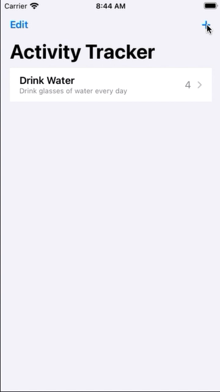

# Day 47 | [HWS 47](https://www.hackingwithswift.com/100/swiftui/47) | [Index](https://github.com/JulesMoorhouse/100DaysOfSwiftUI/blob/main/README.md)

## X05 Tracking

[ContentView](https://github.com/JulesMoorhouse/100DaysOfSwiftUI/blob/main/X05%20Tracking/X05%20Tracking/ContentView.swift) | [AddView](https://github.com/JulesMoorhouse/100DaysOfSwiftUI/blob/main/X05%20Tracking/X05%20Tracking/AddView.swift) | [ActivityView](https://github.com/JulesMoorhouse/100DaysOfSwiftUI/blob/main/X05%20Tracking/X05%20Tracking/ActivityView.swift)

- Challenge.

* Here's a good overview of [topics](https://www.hackingwithswift.com/guide/ios-swiftui/4/1/what-you-learned) covered to date.

